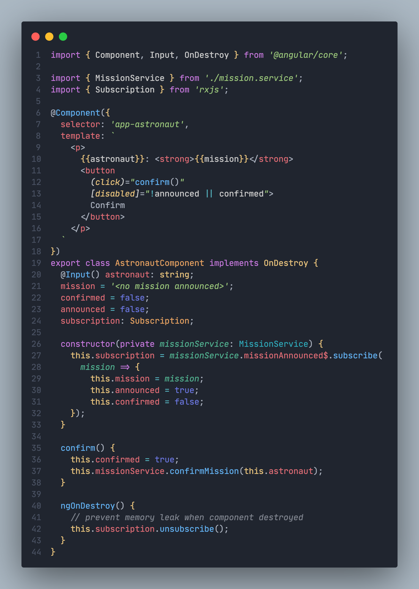

# LeOne Dark Theme
VSCode Color Theme based on [One Dark Pro](https://marketplace.visualstudio.com/items?itemName=zhuangtongfa.Material-theme) theme

## This is how it looks like in an angular component (.ts):

## This is the look for React app:

## In CSS and SCSS it goes like this:

